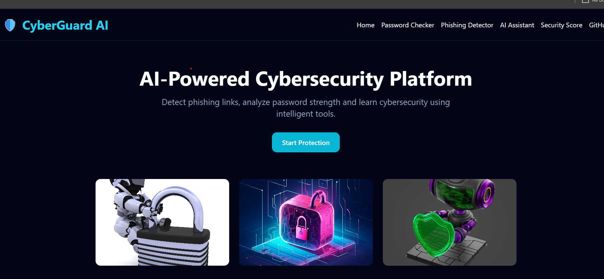
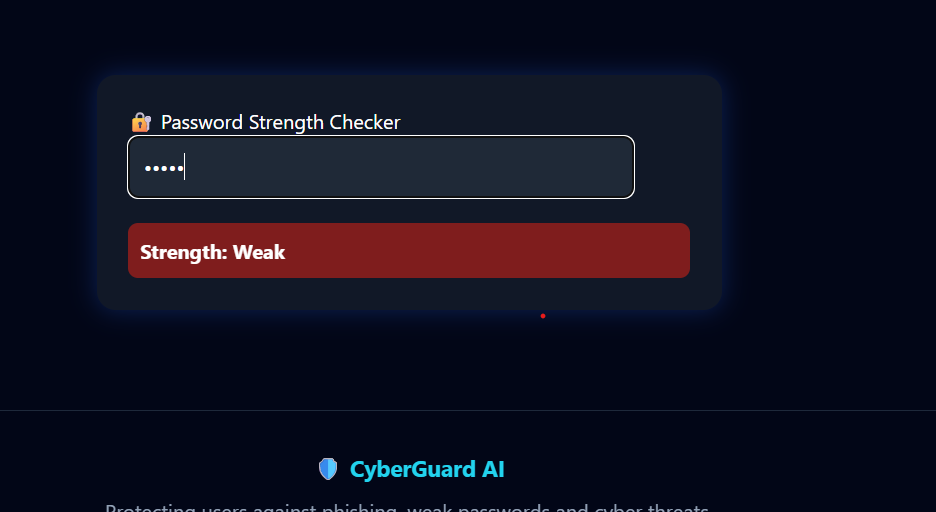
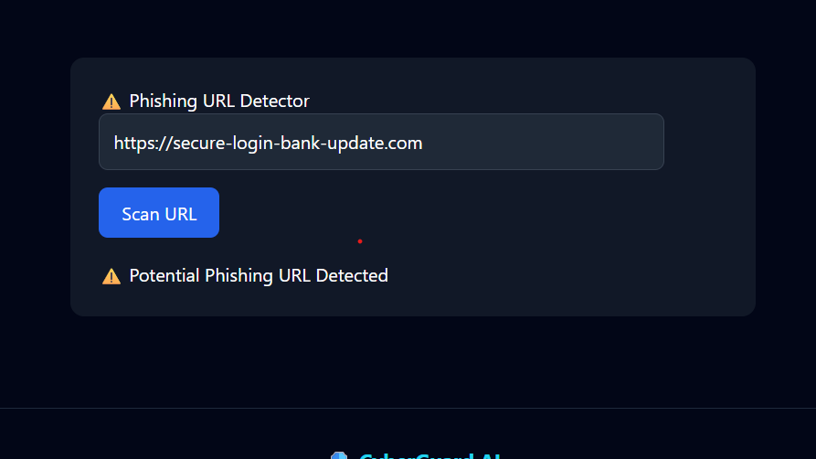
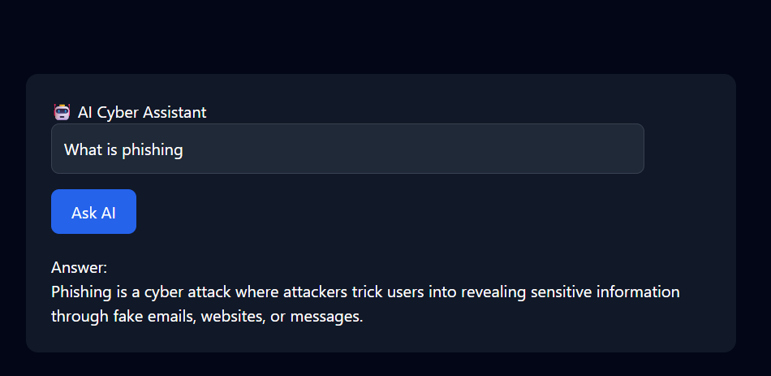

# 🛡 CyberGuard AI

AI-Powered Cybersecurity Protection Platform built using React, Vite and Tailwind CSS.

## 🚀 Live Demo
https://vercel.com/tanik-chopra-s-projects/cyber-guard-ai

## 📌 Features

### 🔐 Password Strength Checker
- Checks password strength
- Detects weak passwords
- Gives instant feedback

### ⚠️ Phishing URL Detector
- Detects suspicious URLs
- Flags common phishing keywords
- Identifies risky shortened links

### 🤖 AI Cybersecurity Assistant
- Answers cybersecurity questions
- Provides awareness tips
- Helps users learn cyber safety

### 🛡 Security Score
- Calculates overall security score
- Shows cybersecurity risk level
- Provides recommendations

## 🖼 Screenshots

### Home Page
(Add screenshot here)


### Password Checker


### Phishing Detector


### AI Assistant


## 🛠 Tech Stack

- React.js
- Vite
- Tailwind CSS
- JavaScript

## 📂 Installation

```bash
git clone https://github.com/Tanik-chopra/CyberGuard-AI.git
cd CyberGuard-AI
npm install
npm run dev

